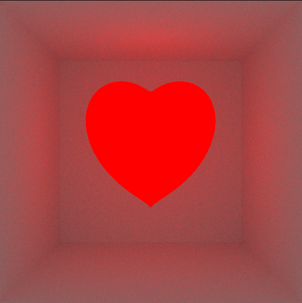

## 介绍
使用glsl实现简单的光线追踪。

## 特征
* 散射，镜面反射，折射
* 三角形，球
* 多帧混合
## 结果

## 参考
* https://blog.csdn.net/weixin_44176696/article/details/119044396
* https://github.com/knightcrawler25/GLSL-PathTracer

## 问题？
1. 从图像中心开始会出现波纹形状？
2. 隐式曲面法线精确计算？